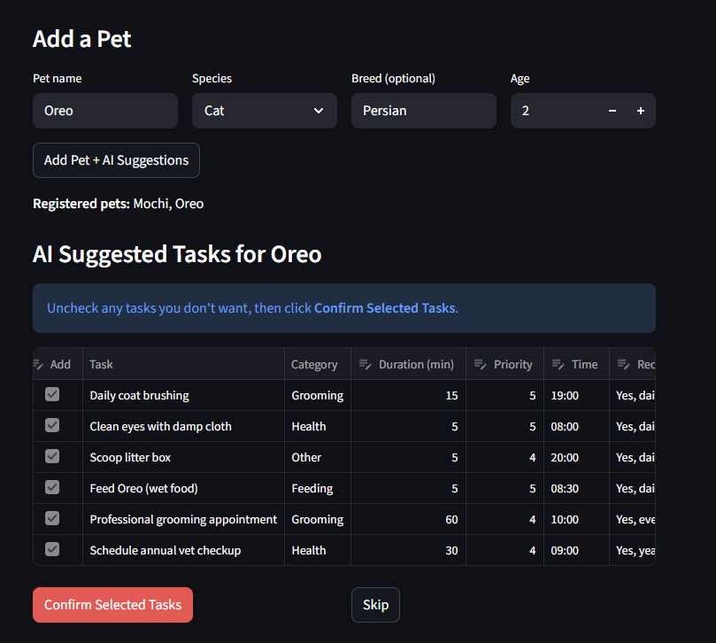
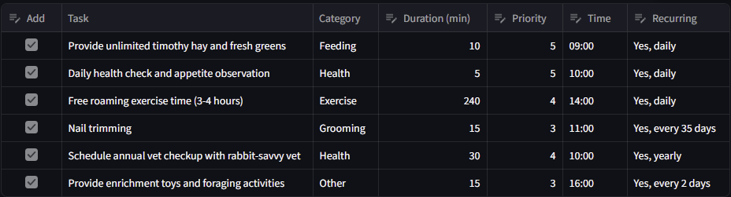

# PawPal AI Task Generator

The original project is PawPal+, a pet care scheduling system built in Module 2. It allowed pet owners to register multiple pets, manually create care tasks with details like priority, duration, and scheduled time, and generate a daily plan that fit within the owner's available time. The system also included sorting, filtering by pet or status, recurring task support, and automatic conflict detection when two tasks were scheduled at the same time.

My project extends the original scheduler by adding an AI-powered onboarding flow. When a new pet is added, the system retrives breed and species care guides from RAG, then passes that information to Claude to generate a personalized starter task list. The user can review, edit, and confirm tasks before they are saved to the schedule.

This project makes it easier for pet owners to create a routine care for their specific pet needs or how often. Instead of manually researching and entering every task, PawPal+ does it for you in seconds.

## System Design & Architecture Overview

View my system diagram in excalidraw!

https://excalidraw.com/#json=4M0cXX9_Z9QB52jtcfEfw,AyuPsHiPfFPwpYIqoC1-0A

PawPal AI Task Generator has four main components. Streamlit UI handles all user input and display such as adding pets, reviewing suggestions, and managing schedule. The RAG Retriever (knowledge_base.py) stores care guides organized by species and breed, and fetches the relevant content when a new pet is added. The AI Agent (agent.py) receives the retrieved care guide along with the pet's details and calls Claude to generate a personalized task list as structured JSON. Finally, the Core Scheduler (pawpal_system.py) handles all task logic such as storing tasks, sorting, filtering, and detecting time conflicts.

## Setup Instructions

1. Clone the repository
   git clone <your-repo-url> cd codepath-final

2. Install dependencies
   pip install -r requirements.txt

3. Set your Anthropic API Key
   export ANTHROPIC_API_KEY="your-key-here"

4. Run the app
   streamlit run app.py

## Sample Interactions

Name: Max | Species: Other | Breed: Rabbit | Age: 2

Output:

## Design Decisions

I chose a static Python dictionary for understanding instead of a vector database. This keeps the project simple for a small set of species and breeds. A dictionary lookup is fast and predictable. The trade-off is that it doesn't scale well if you want to add hundreds of breeds or uploads custom documents.

Also, I added a confirmation step that allows users to choose and edit specific tasks that AI generated. This makes the schedule more personalizable and gives user full control of what actually gets added.

## Testing Summary

The RAG retrieval worked consistently. Adding a breed like Golden Retriever correctly pulled breed-specific care info and Claude generated relevant tasks like coat brushing and ear cleaning rather than generic ones. However, AI generate tasks with the same scheduled time which automatically triggered conflict warnings after confirming.

## Reliability and Evaluation

All 11 automated test in tests/test_ai.py are passing.

Six of them focus on the RAG retriever. They check that the system returns the correct care guides for specific breeds, handles case differences properly, and still works smoothly when the breed or species isn't recognized. The other five tests cover the AI agent, using mocked API calls. These make sure the response gets turned into a clean task list, includes all the required fields, removes any markdown formatting like code fences, and correctly incorporates the pet's details into the prompt sent to Claude.
